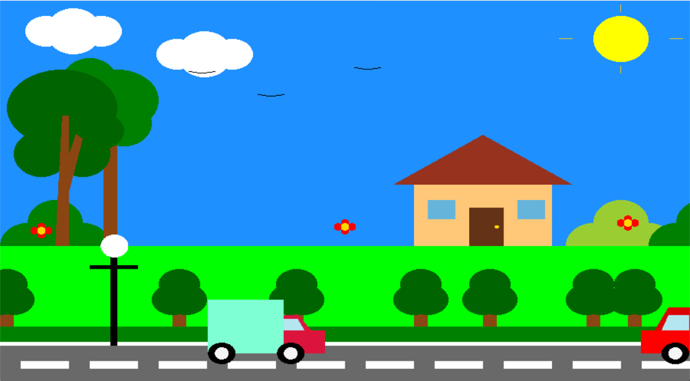
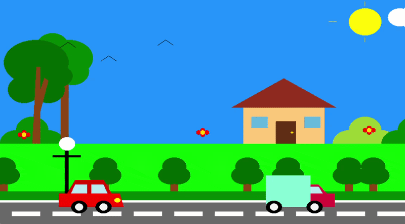

# 🚗 2D Animated Roadside Scene

[](https://www.opengl.org/)
[](https://www.opengl.org/resources/libraries/glut/)
[](https://isocpp.org/)

> **East Delta University**  
> **Department of Computer Science & Engineering**  
> **Course Name:** Computer Graphics Lab  
> **Course ID:** CSE 322.5  
> **Repository:** https://github.com/mdjameee400/2d-roadside-animation.git

---

## 📖 Project Overview

This **2D Animated Roadside Scene** is built using **C++** and the **OpenGL Utility Toolkit (GLUT)** for the Computer Graphics Lab (CSE 322.5) course at East Delta University. The project demonstrates real-time 2D computer graphics rendering, hierarchical transformations, mathematical parametric modeling, and interactive keyboard event handling.

Everything in the scene is rendered entirely from scratch using fundamental OpenGL primitives (`GL_POLYGON`, `GL_LINES`, `GL_TRIANGLES`) and custom trigonometric circle algorithms — without importing any external image textures or assets.

---

## 📸 Screenshots

| Scenario 1: Initial Scene Setup | Scenario 2: Traffic Progression |
| :---: | :---: |
|  |  |
| **Scenario 3: Open Road & Flying Birds** | **Scenario 4: Cloud Drifting & Continuous Loop** |
|  |  |

---

## 🎥 Animation Demo

<div align="center">
  
  <p><em>Real-time 2D animated roadside scene with continuous traffic, flapping birds, and drifting clouds</em></p>
</div>

---

## 📁 Scene Components

| Component | Description |
| :--- | :--- |
| `Sky & Sun` | Vibrant sky backdrop (`GL_POLYGON`) with a parametric radiant yellow sun and orthogonal line rays (`GL_LINES`) |
| `Drifting Clouds` | Overlapping multi-circle cloud clusters with auto-drift and interactive user keyboard translation |
| `Animated Birds` | Flocking bird silhouettes with dynamic trigonometric sinusoidal wing-flapping physics |
| `House & Scenery` | Layered residential home with roof triangle, dual-pane tinted windows, door knob, and surrounding landscape |
| `Foliage & Flora` | Multi-canopy large trees, roadside small trees, clustered green bushes, and vibrant blooming flowers |
| `Roadway & Lighting` | Dark asphalt roadway with iterative dashed lane markings, green verge, and roadside streetlight |
| `Moving Vehicles` | Streamlined red sports car and dual-color cargo truck with windows, headlights, and hubbed wheels |

---

## 🎮 Controls

| Key | Action |
| :--- | :--- |
| <kbd>← Left Arrow</kbd> | Drift clouds to the left (`shift -= 2`) |
| <kbd>→ Right Arrow</kbd> | Drift clouds to the right (`shift += 2`) |
| **Autonomous** | Cars, trucks, clouds, and birds animate continuously upon launch |

---

## 🧩 Features

- Continuous 2D roadside animation with multi-layered scenery
- Two independent vehicle types: Red sports car and cyan cargo truck with differential speeds
- Custom trigonometric circle & ellipse generation algorithm using `sin()` and `cos()`
- Dynamic bird flocking with sinusoidal wing-flapping physics
- Ambient cloud drift with real-time interactive keyboard control (<kbd>←</kbd> / <kbd>→</kbd>)
- Procedural environment: House, layered trees, roadside bushes, flowers, and streetlight
- Matrix stack isolation using `glPushMatrix()` and `glPopMatrix()`
- Automatic boundary wrap-around for infinite looping animation
- Flicker-free double-buffered RGB rendering with `GLUT_DOUBLE` and `glutSwapBuffers()`

---

## 📂 Project Directory Structure

```text
2d-roadside-animation/
├── resources/
│   └── img/
│       ├── 2D_Street_View-ezgif.gif # Live animation recording
│       ├── one.png                  # Scenario 1: Initial Scene Setup
│       ├── scenario two.png         # Scenario 2: Traffic Progression
│       ├── scenario three.png       # Scenario 3: Open Road & Flying Birds
│       └── scenario four.png        # Scenario 4: Cloud Drift & Vehicle Loop
├── .gitignore                       # Excludes heavy video files from repository
├── main.cpp                         # Complete OpenGL / GLUT source code
└── README.md                        # Project documentation & walkthrough
```

---

## 🛠️ Installation and Configuration

This project requires a C++ environment configured with the OpenGL/GLUT library. The instructions below outline how to set up the project using the **Code::Blocks** IDE with **MSYS2 (MinGW64)**.

### 1. Prerequisites

Before proceeding, ensure that **Code::Blocks** and the **MinGW64** compiler are installed. You will also need the **FreeGLUT** development files (headers, libraries, and DLLs) configured on your system.

- **OS:** Windows
- **IDE:** Code::Blocks
- **Toolchain:** MSYS2 MinGW 64-bit
- **Libraries:** OpenGL & FreeGLUT

### 2. MSYS2 & FreeGLUT Setup

1. **Install MSYS2:** Download and install MSYS2 from [msys2.org](https://www.msys2.org/) (default path: `C:\msys64`).
2. **Install FreeGLUT:** Open the **MSYS2 MinGW 64-bit** terminal (`MINGW64`) from the Start Menu and run:
   ```bash
   pacman -S mingw-w64-x86_64-freeglut
   ```
   *Press `Y` and Enter when prompted. FreeGLUT files will be installed under `C:\msys64\mingw64`.*

### 3. Code::Blocks Configuration

Open your project in **Code::Blocks**, navigate to **Project → Build options...**, and select the top-level project name from the left panel:

- **Compiler Search Directory:**  
  Go to **Search directories → Compiler** and click **Add**:
  ```text
  C:\msys64\mingw64\include
  ```

- **Linker Search Directory:**  
  Go to **Search directories → Linker** and click **Add**:
  ```text
  C:\msys64\mingw64\lib
  ```

- **Linker Libraries:**  
  Go to **Linker settings** and add the following libraries under **Link libraries**:
  ```text
  freeglut
  opengl32
  glu32
  ```

- **FreeGLUT Runtime DLL:**  
  Copy `libfreeglut.dll` from `C:\msys64\mingw64\bin\libfreeglut.dll` to your project's executable output directory:
  ```text
  YourProject\bin\Debug\
  ```

### 4. Code Integration & Running

1. In the **Management** side panel, expand the **Sources** folder and open `main.cpp`.
2. Delete any existing template boilerplate inside the editor.
3. Copy the source code from this repository's [main.cpp](file:///d:/East%20Delta%20University/9th%20sem/Graphics%20Lab%20%28GLUT%20project%20%29/main.cpp) and paste it into the editor.
4. Save the file and press <kbd>F9</kbd> (or go to **Build → Build and run**).
5. The OpenGL graphics window will launch and display the animated roadside scene.

---

## 👥 Group Information & Contributors

| Student Name | Student ID | Department | Role / Contribution |
| :--- | :--- | :--- | :--- |
| **[MD Abdullah Al Jamee](https://github.com/mdjameee400)** | *233028912* | CSE | Animation & Road Physics |
| **[Efti Hasan](https://github.com/Efti-Hasan)** | *233031412* | CSE | Environment, Lighting & Sky Cycle |
| **[Chowdhury Shams Intisar](https://github.com/intisar)** | *233030512* | CSE | Vehicle Modeling, Transformations & Interactivity |
